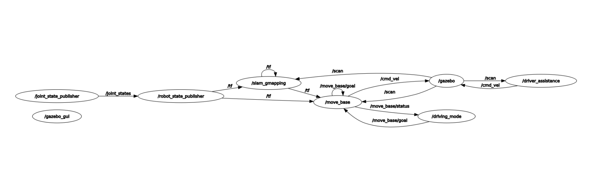
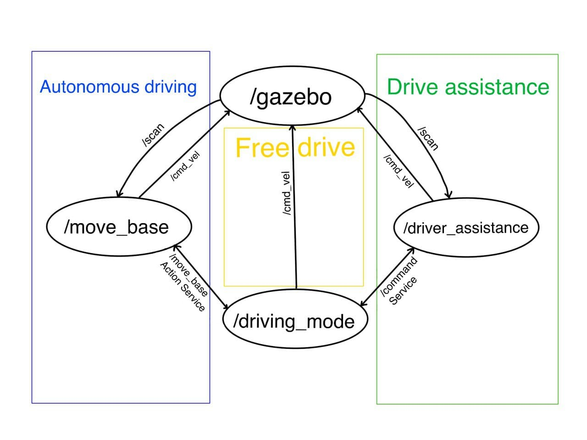
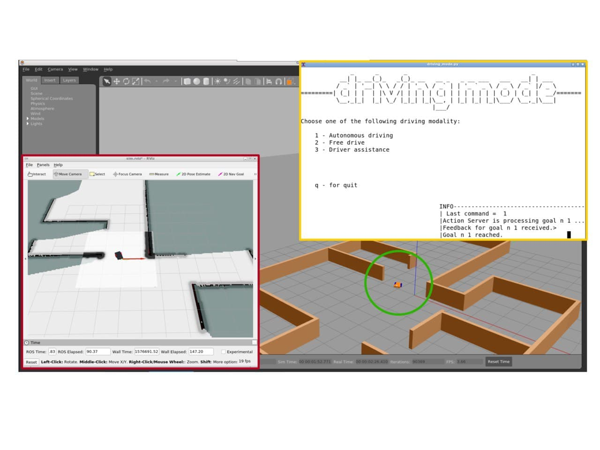

Robotics simulator on ROS
=============================

>This ROS package aims to control an autonomous robot that wanders into an unknown map, equipped with a laser scanner and knowing its odometry.
>Here you can find the [code documentation](https://ettore9x9.github.io/rt2_assignment/).

Installing and running
----------------------

>Clone this repository in the `src` folder of your ROS workspace, compile it with `catkin_make`; and run it with:

```bash
$ roslaunch final_assignment assignment.launch
```

>For compiling and running, you need the `xterm` package; you can install it with:

```bash
$ sudo apt-get update
$ sudo apt-get install xterm
```

Assignment
----------

>The objective of the assignment is to control the robot with three different driving modalities:
 * Autonomous driving: the robot must reach a goal autonomously.
 * Free drive: the user controls the speed of the robot directly.
 * Drive assistance: the user moves the robot through a controller that prevents collisions.

 The node `driving_mode` switches between these different modalities, as specified by the user.

>The Gazebo simulator reproduces the robot's behavior in the environment, publishing the output of the robot's sensors such as the laser scanner on the topic */scan*, and the odometry on the */odom* topic. The robot is controlled by publishing the velocity on the */cmd_vel* topic.

>This is a general scheme of the nodes involved in the autonomous driving case:

<p align="center">

</p>

>This is the communication structure between controller nodes:

<p align="center">

</p>

### Autonomous driving

>For autonomously driving the robot, the program sends a goal to the action server */move_base*, receiving feedbacks and monitoring the status until the goal is reached or canceled.
 Thanks to the *gmapping* algorithm, the robot can create a map of the surrounding environment during its tours. The `move_base` node implements the action server to control the robot through the shortest path to reach the given position.
 The user can also require to cancel the current goal or to send a new one.
 The `driving_mode` node asks the user to insert the goal with the `ask_for_goal` function.

### Free drive

>The function used to implement the free drive modality is in the `free_drive.py` file. It publishes the robot's speed on the topic */cmd_vel* each time the user inputs a command.

### Driver assistance

>The driver assistance modality uses the `driver_assistance` node, described in the second assignment, slightly changed to be turned on and off when it is used or not. For this reason, the code of the node is written in C++.
>The `client_drive_assistance.py` file contains the function to send a request to the `driver_assistance` node through the Command service, defined in the `srv` folder.

### User interface

>The user interface of the program is in `user_interface.py`. It is implemented with the *curses* library, dividing the terminal into windows and calling specific functions to print strings and receive user inputs.
 The class `windows_organiser` stores all information about the user interface and implements some modes to make the code slighter.

>This is the user interface for the autonomous driving modality:

<p align="center">

</p>

>This is the user interface for the free drive and the drive assistance modalities:

<p align="center">

</p>

### Global view

>This is a global view of the user interface and the environment in the simulation:

<p align="center">

</p>

-  robot in the gazebo environment
-  sim-rviz robot sensors
-  user interface

Possible improvements
---------------------

* Implements a modality to autonomously map all the environment.
* Implements an emergency stop service.
